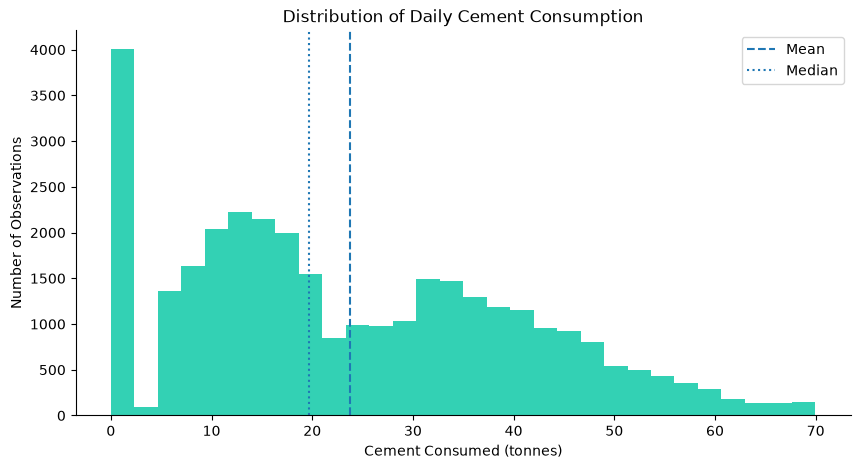
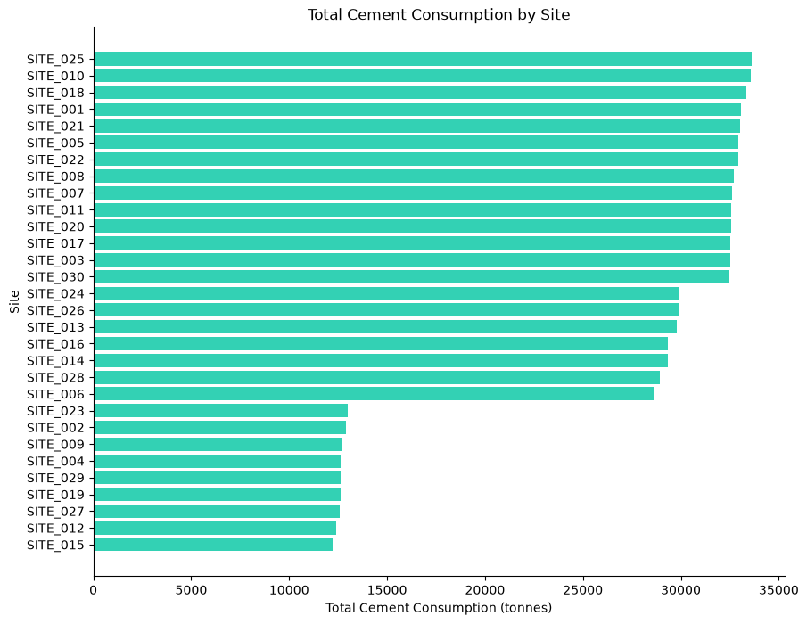
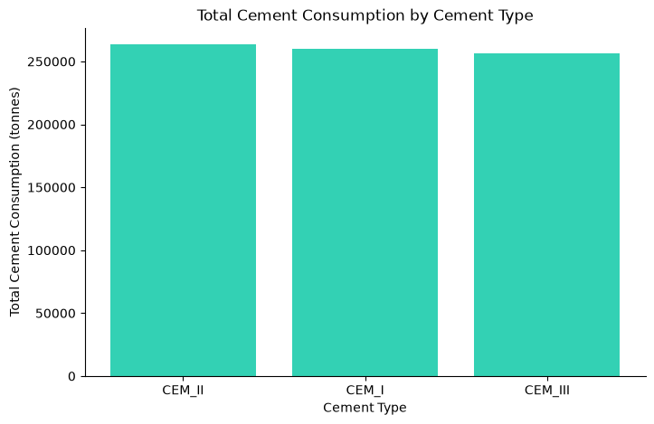
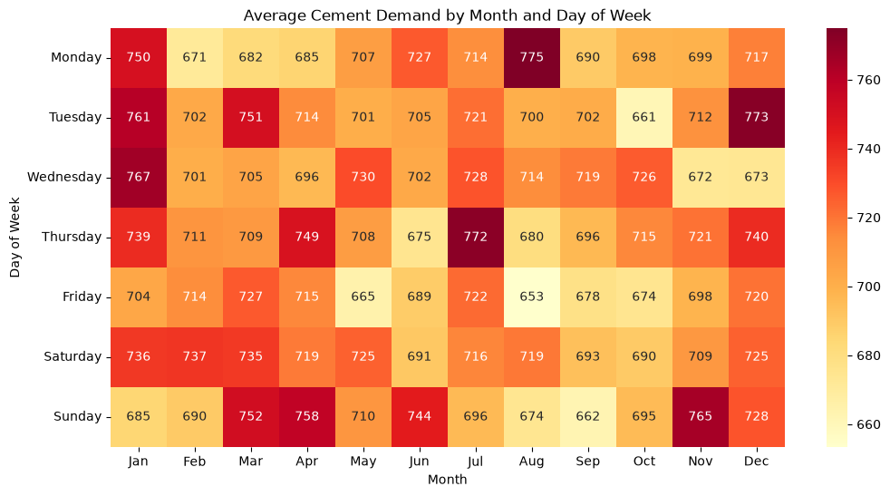
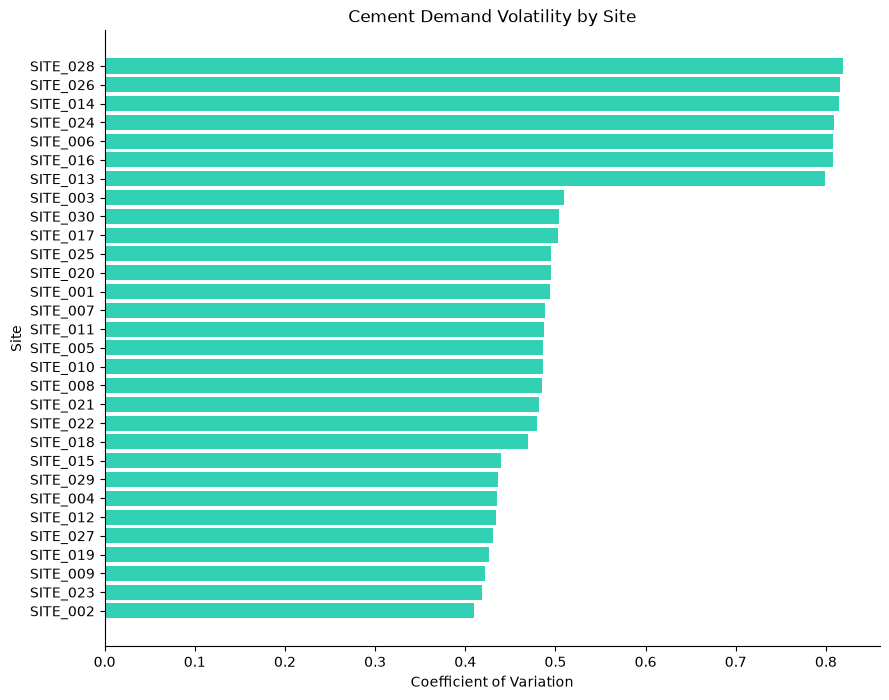
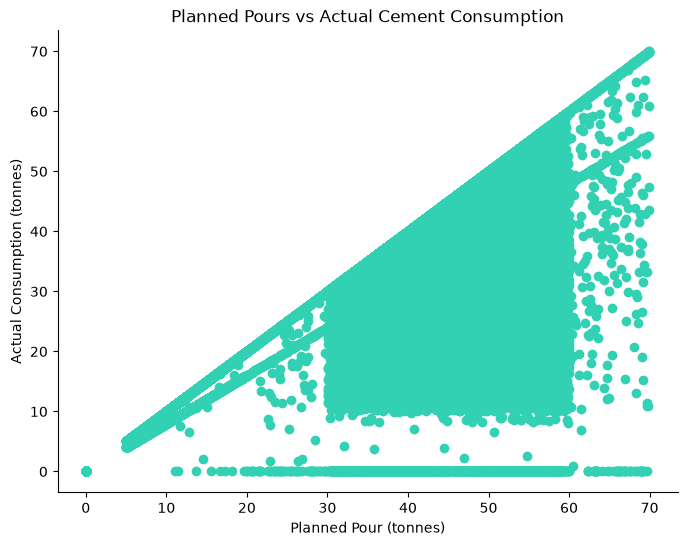
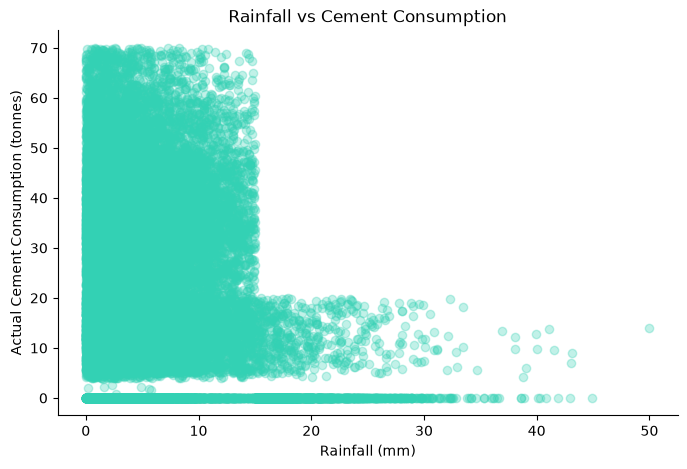
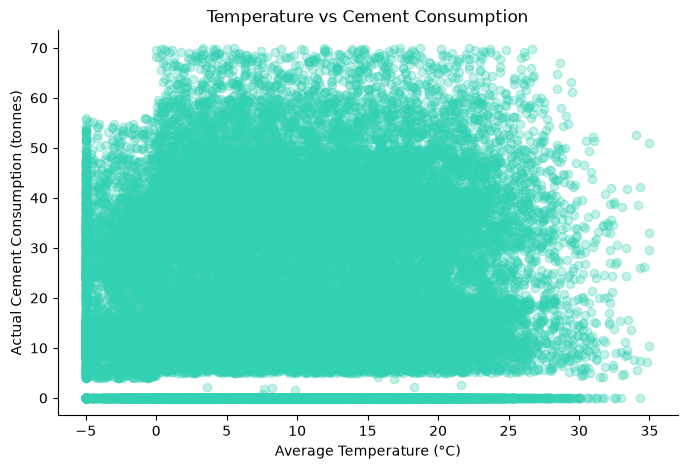
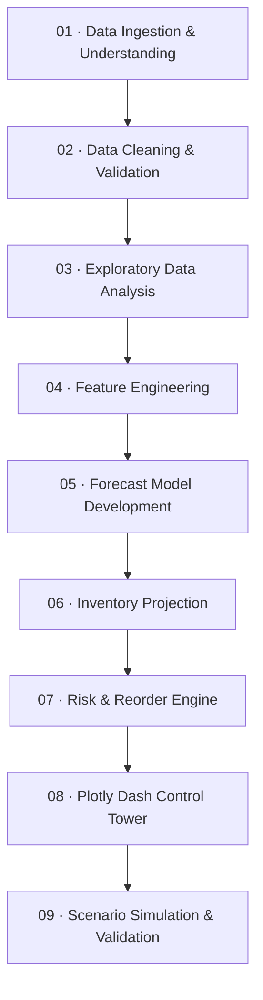

<div align="center">

# 🏗️ MIG Cement Intelligence & Inventory Control Tower

### **Forecast demand. Protect pours. Control inventory.**

A forecasting and inventory decision-support system for multi-site cement operations — built to move MIG from **reactive ordering** to **proactive, data-driven planning**.

<br>


<br>

**32,880 operational records · 30 sites · 3 cement types · 8-week planning horizon**

       https://cement-demand-forecasting-across.onrender.com/ 

</div>

---

## Executive Summary

Midlands Infrastructure Group (MIG) operates multiple construction sites where cement availability is mission-critical. The operational challenge is not simply forecasting how much cement will be used. MIG must know **what each site is likely to consume, whether inventory will remain sufficient, where stockout risk is emerging, and when a reorder should be triggered**.

This project therefore connects four layers of decision intelligence:

1. **Demand Forecasting** — estimate future cement consumption at site level.
2. **Inventory Projection** — translate forecast demand into future stock positions.
3. **Risk & Reorder Engine** — identify stockout / overstock exposure and recommend action.
4. **Plotly Dash Control Tower** — give operations managers one interactive view of forecasts, inventory, risk and scenarios.

> **The forecast is not the final product. The decision is.**

---

## The Business Problem

MIG's cement planning process is exposed to four recurring operational risks:

| Business pain point | Operational consequence |
|---|---|
| **Stockouts** | Scheduled pours can be delayed while labour and equipment remain idle. |
| **Overstocking** | Excess stock occupies silo capacity, ties up working capital and increases waste exposure. |
| **Reactive ordering** | Urgent deliveries can increase logistics cost and reduce procurement efficiency. |
| **Limited visibility** | Site-level planning becomes fragmented, making cross-site prioritisation difficult. |

The central question is:

> **How can MIG predict future cement demand early enough to make better inventory, procurement and pour-readiness decisions?**

---

## Business Targets

These are the **project targets**, not automatically claimed as achieved outcomes.

| Objective | Target |
|---|---:|
| Forecast accuracy | **MAPE ≤ 15%** |
| Forecast horizon | **Up to 8 weeks** |
| Pour readiness | **≥ 98%** |
| Inventory utilisation improvement | **20%** |
| Material write-off reduction | **30%** |
| Decision visibility | Interactive forecast, inventory, risk and reorder dashboard |

---

## Why This Project Goes Beyond Forecasting

| A forecasting notebook | MIG Control Tower |
|---|---|
| Predicts demand | Predicts demand **and translates it into action** |
| Stops at model metrics | Connects forecasts to inventory exposure |
| Produces static outputs | Provides interactive site-level decision support |
| Tells users what may happen | Helps users decide **what to do next** |
| Uses one assumed future | Adds a **scenario simulator** for operational what-if analysis |

---

## End-to-End Architecture


The analytical sequence is deliberately separated:

**Historical operations → demand forecast → inventory projection → stockout / overstock assessment → reorder decision → management action**

This avoids mixing the forecasting problem with the inventory decision problem.

---

## CRISP-DM Methodology

The project follows the **CRISP-DM** framework so that the modelling remains tied to a real operational decision.

| CRISP-DM stage | MIG implementation |
|---|---|
| **Business Understanding** | Define stockout, overstock, pour-readiness and procurement objectives. |
| **Data Understanding** | Inspect the SQLite tables, grain, variables, demand behaviour and inventory relationships. |
| **Data Preparation** | Validate references, clean operational records and create forecast-ready features. |
| **Modelling** | Compare forecasting approaches using historical demand and operational predictors. |
| **Evaluation** | Use hold-out / time-aware validation and business-relevant forecast error measures. |
| **Deployment** | Convert forecasts into inventory, risk and reorder intelligence in Plotly Dash. |

---

## Dataset

The operational dataset contains **32,880 rows and 11 core variables** at approximately the **date × site × cement-type** grain.

### Core Tables

- `Operations`
- `Sites`
- `CementTypes`

### Core Variables

| Variable | Role |
|---|---|
| `date` | Time index |
| `site_id` | Site identifier |
| `cement_type` | Cement grade / product |
| `planned_pour_tonnes` | Planned construction demand |
| `consumed_tonnes` | **Primary forecasting target** |
| `opening_inventory_tonnes` | Beginning stock position |
| `deliveries_tonnes` | Inventory inflow |
| `closing_inventory_tonnes` | Ending stock position |
| `rain_mm` | Weather signal |
| `avg_temp_c` | Weather signal |
| `silo_capacity` | Physical storage constraint |

### Inventory Integrity Rule

A core validation relationship is:

```text
Closing Inventory = Opening Inventory + Deliveries - Consumption
```

This is used as both a **business rule** and a **data-quality check**.

---

## Forecast-Time Discipline: Preventing Target Leakage

One of the most important modelling choices in the project is deciding **what information would genuinely be available when the forecast is made**.

For example:

```text
Consumption = Opening Inventory + Deliveries - Closing Inventory
```

Using the same day's `closing_inventory_tonnes` to predict the same day's `consumed_tonnes` would reveal part of the answer to the model.

That could produce impressive-looking accuracy without genuine forecasting ability.

### Potentially known in advance

- forecast date
- site
- cement type
- planned construction schedule
- silo capacity
- scheduled deliveries, where genuinely known

### Historical information

- previous consumption
- previous inventory
- previous deliveries
- historical weather

### Not treated as automatically known future information

- actual future consumption
- actual future closing inventory
- unscheduled future deliveries
- actual future rainfall unless a forecast source is explicitly available

---

# Exploratory Data Analysis

EDA was used to answer operational questions — not simply to produce charts.

## 1. Demand Is Uneven and Right-Skewed

Average cement consumption is approximately **23.7 tonnes per operational record**. The distribution is right-skewed: some records show zero consumption while high-demand observations exceed **69 tonnes**.

<p align="center">
  
</p>

### Business meaning

MIG should not treat demand as a stable average. The distribution contains both inactive / low-demand periods and high-demand operating periods, which makes site-level forecasting and inventory buffers important.

---

## 2. Site Behaviour Is Not Uniform

Total demand differs substantially across sites, meaning a single portfolio-wide average would hide meaningful operating differences.

<p align="center">
  
</p>

Possible drivers include project scale, activity intensity, pour schedules and site-specific operating conditions.

---

## 3. Cement Types Are Relatively Balanced

Demand across the three cement types is broadly similar, although **CEM II contributes slightly more than 34% of total consumption**, making it the largest individual share.

<p align="center">
  
</p>

This suggests cement type should be preserved in the forecasting problem even though no single type overwhelmingly dominates the portfolio.

---

## 4. Broad Seasonality Is Weak — Granular Calendar Patterns Matter More

Average monthly and weekday demand are relatively stable, but the **month × weekday heatmap** reveals patterns hidden by simple averages.

<p align="center">
  
</p>

Notable combinations include:

- **Monday → August**
- **Tuesday → December**
- **Wednesday → January**
- **Thursday → July**
- **Sunday → November**

Friday and Saturday do not show similarly clear recurring high-demand peaks.

### Business meaning

A forecasting model should preserve calendar interactions rather than relying only on a simple month or weekday average.

---

## 5. Forecasting Difficulty Varies by Site

Demand volatility differs meaningfully across MIG's sites.

<p align="center">
  
</p>

**Sites 28, 26, 14, 24 and 06** appear among the most volatile based on relative variation in demand.

This matters because forecast difficulty is unlikely to be uniform across the portfolio. More volatile sites may require closer monitoring, wider safety buffers or stronger operational review.

---

## 6. Planned Pours Are a Strong Forecasting Signal

Planned pour quantity has a clear positive relationship with actual cement consumption.

**Correlation ≈ 0.781**

<p align="center">
  
</p>

This makes planned construction activity a valuable forecasting input.

> The relationship is associative, not proof of causality.

---

## 7. Rainfall Matters More Than Temperature Linearly

Historical rainfall shows a strong negative relationship with cement consumption: higher rainfall is generally associated with lower cement usage.

<table>
<tr>
<td width="50%">

</td>
<td width="50%">

</td>
</tr>
</table>

Temperature shows a much weaker **linear** relationship with consumption.

That does not mean temperature is irrelevant. It may still interact with season, rainfall, site conditions or other features in non-linear ways.

---

## EDA → Modelling Decisions

The exploratory analysis directly informs the feature strategy.

| EDA evidence | Modelling implication |
|---|---|
| Site demand differs | Preserve **site-level effects** |
| Cement types are distinct | Preserve **cement type** |
| Month / weekday averages hide interactions | Include **calendar features and interactions** |
| Demand is volatile | Add **historical lag and rolling-demand features** |
| Planned pours correlate strongly with consumption | Use **planned pour signals** |
| Rainfall is operationally informative | Retain **weather information where forecast-time availability is justified** |
| Volatility differs across sites | Evaluate performance beyond a single portfolio average |

---

## Feature Engineering Strategy

The forecasting layer is designed around features that capture **recency, seasonality, operating plan and site behaviour**.

### Calendar features
- month
- weekday
- week / seasonal position
- month × weekday interactions where useful

### Historical demand features
- lagged cement consumption
- rolling averages
- rolling variability
- recent demand momentum

### Operational planning features
- planned pour quantities
- planned-vs-historical demand context
- site and cement-type information

### Weather features
- rainfall
- temperature
- weather interactions where justified

### Inventory context
Inventory variables are used carefully so that same-period target leakage is avoided.

---

## Forecast Model Development

The project specification compares statistical and machine-learning forecasting approaches, including:

- **SARIMAX / time-series baselines with external regressors**
- **Random Forest / machine-learning forecasting with operational predictors**

Model selection is based on **time-aware hold-out performance** rather than random train/test splitting.

The project uses **MAPE as a core business-facing accuracy measure**, with supporting error diagnostics used during comparison.

Model comparison outputs are persisted for downstream reporting in:

```text
outputs/model_comparison.csv
```

---

# Inventory & Reorder Intelligence

Forecasting answers:

> **How much cement is likely to be consumed?**

Inventory intelligence answers:

> **Will the site have enough cement when that demand arrives?**

A simplified projection is:

```text
Projected Inventory
= Current / Opening Inventory
+ Expected Deliveries
- Forecast Demand
```

The projected stock position is then assessed against:

- upcoming forecast demand
- silo capacity
- delivery assumptions
- operational safety requirements
- stockout / overstock thresholds

The decision engine produces outputs such as:

- projected inventory
- silo utilisation
- stockout risk
- overstock exposure
- reorder requirement
- recommended replenishment action

A key downstream output is stored in:

```text
outputs/risk_reorder_recommendations.csv
```

---

# Plotly Dash Control Tower

The dashboard turns model outputs into an operational product.

### Decision modules

**Executive Overview**  
Portfolio-level KPIs, model summary, operational exposure and management signals.

**Forecast Intelligence**  
Site- and cement-level demand outlook across the planning horizon.

**Inventory Projection**  
Expected stock movement and silo position after forecast demand and deliveries.

**Risk & Reorder**  
Prioritised stockout / overstock exposure and replenishment recommendations.

**Model Performance**  
Transparent comparison of forecast performance and model quality.

**Scenario Simulator**  
Interactive what-if analysis for changing demand or delivery assumptions before operational decisions are made.

> The simulator is intentionally a **decision layer**, not a decorative page. Its value is showing how changed assumptions alter inventory, risk and reorder implications.

---

## Scenario Simulator

The simulator allows an operations user to ask questions such as:

- What happens if demand rises above the base forecast?
- What happens if a delivery is reduced or delayed?
- Which sites move into a higher stockout-risk state?
- How does the recommended reorder quantity change?
- Does additional inventory create silo-capacity pressure?

This makes the application useful for **planning under uncertainty**, rather than only displaying one fixed forecast.

---

# Repository Workflow



### Important generated outputs

```text
outputs/
├── model_comparison.csv
└── risk_reorder_recommendations.csv
```

The wider project also includes reproducible notebooks / scripts, dashboard pages and supporting analytical outputs.

---

# Technology Stack

| Layer | Technology | Purpose |
|---|---|---|
| Data storage | **SQLite** | Operational source data |
| Data processing | **Python, pandas, NumPy** | Cleaning, transformation and features |
| Forecasting / ML | **scikit-learn, statsmodels** | Forecast development and comparison |
| Visualisation | **Plotly** | Interactive analytical charts |
| Application | **Dash** | Multi-page decision-support Control Tower |
| Version control | **Git / GitHub** | Reproducibility and project packaging |

---

# Key Business Findings

The EDA supports five important conclusions:

1. **MIG does not have one universal cement-demand pattern.**  
   Site behaviour and volatility differ enough that local context matters.

2. **Construction plans contain strong predictive information.**  
   Planned pours and actual consumption have a correlation of approximately **0.781**.

3. **Weather is operationally relevant.**  
   Rainfall is associated with lower cement consumption, while temperature shows limited linear influence in the current analysis.

4. **Simple averages hide useful seasonality.**  
   Month × weekday combinations expose specific higher-demand operating windows.

5. **Forecasting must connect to inventory decisions.**  
   Predicting demand has limited business value unless the output is translated into stockout risk, silo utilisation and reorder action.

---

# Business Value

The completed system is designed to help MIG move from:

| From | To |
|---|---|
| Reactive cement ordering | **Proactive replenishment** |
| Manual judgement alone | **Forecast-supported decisions** |
| Portfolio averages | **Site-level intelligence** |
| Static inventory reporting | **Forward inventory projection** |
| Late stockout discovery | **Early risk detection** |
| Fixed assumptions | **Scenario-based planning** |

The intended outcome is a more resilient cement-planning process that protects scheduled pours while reducing unnecessary inventory and waste.

---

# Limitations & Responsible Interpretation

- Correlation does not establish causation.
- Historical patterns may change as project mix and site activity change.
- Weather variables are only useful operationally when reliable forecast-time weather information is available.
- Forecast accuracy can vary by site because demand volatility differs materially across the portfolio.
- Inventory recommendations depend on the quality of delivery assumptions and operational thresholds.
- Business targets such as MAPE ≤ 15% or ≥ 98% pour readiness should only be presented as achieved when validated by final evaluation results.

---

# Next Development Priorities

- production deployment of the Dash application
- systematic forecast monitoring by site and cement type
- model-retraining triggers when performance deteriorates
- stronger delivery-lead-time modelling
- scenario comparison across multiple sites
- procurement-level rollups for coordinated ordering
- further sensitivity testing of safety-stock and reorder rules

---

<div align="center">

### **Forecast Earlier · Reorder Smarter · Keep Every Pour Ready**

**MIG Cement Intelligence & Inventory Control Tower**

</div>
